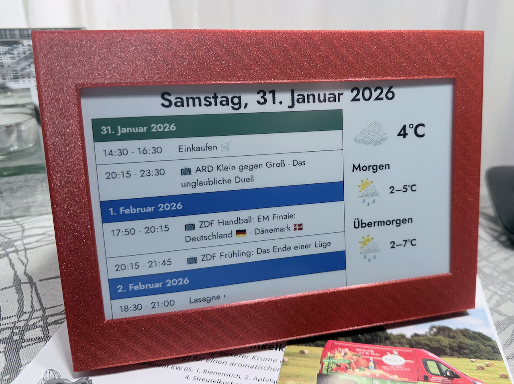

# InkyPi-Plugin-seniorDashboard_allDay


*InkyPi-Plugin-seniorDashboard_allDay* is a plugin for [InkyPi](https://github.com/fatihak/InkyPi) that shows a simple, at-a-glance view of the next few days: a calendar list and a small weather block. It is intended for an elderly person who has a calendar maintained for them by a family member or carer.

**What it does:**

- **Calendar** — Displays today and the next two of days in a list. Events that have already ended are hidden. 
- **Weather** — Shows current conditions and a short forecast (e.g. tomorrow and the day after) in a minimal layout: icon and temperature, with high/low for the next days.
It uses the DWD (Deutscher Wetter Dienst) free API, so no API-key config needed.
- **Connection-loss handling & auto-recovery** — If the device loses its internet connection, the display no longer fails silently with stale information. Instead it shows a clear, localized "no connection" screen and reboots itself automatically to recover. See [Connection loss handling & auto-reboot](#connection-loss-handling--auto-reboot) below.

The layout is kept clear and low-clutter so it works well on an e-ink display and for quick, easy reading.

It is optimized for and tested only on landscape waveshare 7.2 inch display but should render ok on every comparable landscape display.

It's basically a mix of the calendar list view and weather template.
No additional dependencies whatsoever.

**Settings:**

Language can be set to **English**, **French** , **Spanish**  or **German**. 
Other languages can easily be added in *constants.py*, just make sure to use the correct international language ID so the calendar returns correct dates/formats.
You can add multiple calendars, they will all be used to compile the today, tomorrow and day after tomorrow list.
Location setting for the weather (DWD supplies world wide weather info).
Font size for the Calendar listing.


## Connection loss handling & auto-reboot

This plugin is built for an unattended display that someone depends on every day. A common real-world problem is that the Raspberry Pi or the router drops the Wi-Fi connection (often due to power-save), the calendar can no longer be fetched, and the display **quietly keeps showing stale information** — which is exactly what you don't want for someone who relies on it to know the date and their appointments.

To handle this gracefully, on every refresh the plugin first checks whether the configured calendar URL(s) are reachable:

- **Online** — normal update. (If a reboot had been scheduled by a previous failed refresh, it is automatically cancelled.)
- **Offline** — instead of failing silently, the display shows a clear, fully localized screen with:
  - today's date (so the day is still visible at a glance),
  - a "no internet connection" notice,
  - and the time at which the device will **automatically restart** (10 minutes after the failed refresh).

  When that time is reached, the device reboots itself, which typically restores the Wi-Fi connection and resumes normal updates. If the connection comes back on its own before the timer fires, the pending reboot is cancelled and the normal dashboard returns.

**Details and design choices:**

- The reboot is only triggered by a genuine **network failure** (timeout / connection refused / DNS). If the calendar *server* is reachable but returns an HTTP error (e.g. 404/500), no reboot is triggered, since a reboot would not fix a broken feed.
- With multiple calendars configured, the device is only considered offline when **none** of them can be reached.
- The 10-minute delay before rebooting prevents fast reboot loops if the connection stays down.
- The displayed reboot time stays stable across refreshes during the same outage.
- The reboot uses the same `sudo reboot` mechanism as InkyPi's built-in Reboot button, so it relies on the passwordless-sudo setup that a standard InkyPi installation already configures. No extra setup is required.
- All offline texts are localized in the same languages as the rest of the plugin (English, German, Spanish, French) and follow the device's 12h/24h time format. New languages can be added in `constants.py` (`offlineTitle`, `offlineMessage`, `offlineClock`, `offlineReassure`).


## Installation

### Install

Install the plugin using the InkyPi CLI, providing the plugin ID and GitHub repository URL:

```bash
inkypi plugin install seniorDashboard_allDay https://github.com/RobinWts/InkyPi-Plugin-seniorDashboard_allDay
```

or install the [PluginManager](https://github.com/RobinWts/InkyPi-Plugin-PluginManager) first and use that to install via WebUI.


## Development-status

Feature complete and done for the moment. Probably will update in the future if needed.

## License

This project is licensed under the GNU public License.
